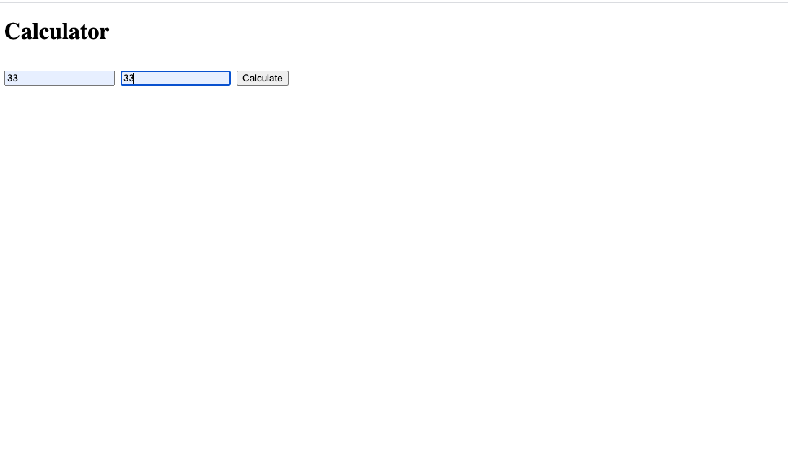

# Express-Calculator

 ## Application description:

A  simple node and express based application  that allows the user to calculate  and add numbers  that they put in the input field. The result is then posted to the user.
 

 ## Click [here]( https://drive.google.com/file/d/1st81mTUOYSjZLR8BM8L4XhmB7BJDGgAG/view?usp=sharing) to view a video of the app. 
 
 This is the home screen:
 
 
 
 Two number are then added:
 
 
 
  The result is then displayed and posted to the user:
 
  
 
 

  
  

     
## Libraries and Frameworks:

- HTML
- CSS
- Javascript
- Node
- Express

## Email:

bml201095@gmail.com
